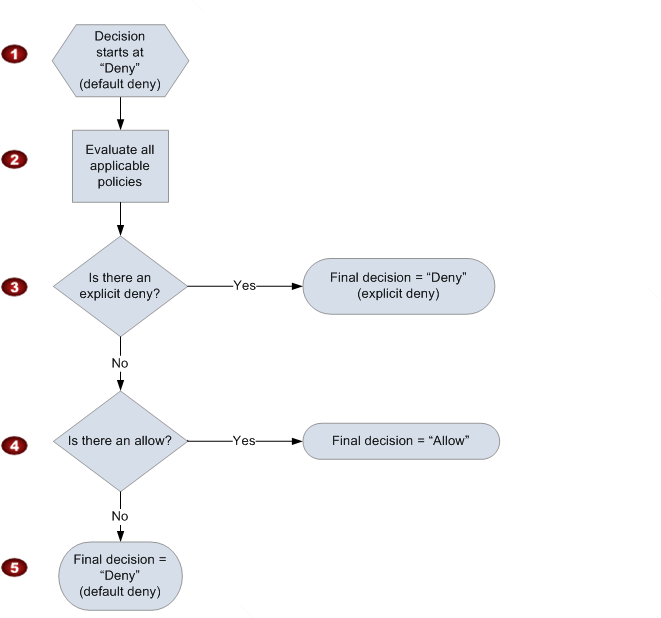

# AWS Security & Compliance

> Arav Budhiraja | 20th August 2021

## Topics

1. Identity and Access management(IAM)
2. Compliance

## Learning Objectives

1. Describe and understand the purpose for 
	- Identity and Access management(IAM)
		- Reality of security in the cloud
		- Entities in IAM(users, groups, roles, etc)
		- Policy, policy evaluations and the AWS Policy Generator
2. Trusted Advisor
3. Inspector 
4. Audit Manager 
5. Artifact 
6. The "Services in Scope" web page
7. Shield and Shield Advanced
8. GuardDuty
9. Macie

## AWS Identity & Access Management (IAM)

* Reality of security 
* IAM Entities 
	* Users
	* Groups 
	* Roles
* IAM Policy 
	* Statements 
	* Evaluation 
* Policy Generator

### Reality of security 

Businesses in the cloud follow this process for building an app- code --> build --> test --> deploy --> security

However, we have to make security the first and top priority- security --> code --> build --> test --> deploy 

We also have to incorporate security in all aspects, writing secure code, securely building it, etc

When on prem, there is a lot of work such as ordering the server, putting the server in the rack, powering on the server and connecting it to the network. This does not need to be done in the cloud

This work is known as undifferentiated lifting and is work which we do that does not differentiate us from someone else in the field

We want to minimize this work and the cloud does it for us 

Instead of spending time on undifferentiated lifting, we should spend time on improving our security. Trade undifferentiated lifting for improved security 

MAKE SECURITY JOB 0

### IAM

IAM is the core of a security infrastructure in AWS

It is used to manage access to AWS and to secure resources. It is free and is used to create users, groups, roles and policies 

AWS checks the IAM policies when an access attempt is made

#### IAM User

Represents a person or application within AWS that will be interacting with AWS

Accesses AWS using passwords/access keys/SSH keys 

In most cases it is a user using a password and multi factor authentication 

Maintaining individual permission for many users is not scalable

Best practice: Put users into a group and set permissions for that group

##### Creating an IAM User

1. Search for 'IAM' and click on 'IAM'
2. On the left hand side, click on 'Users' below 'Access Management'
3. Click on the blue button which says 'Add user'
4. Provide a username and give it 'AWS Management Console access'. 'Programmatic Access' can be enabled if we wish to run scripts in the console and use the CLI
5. Now select custom password and enter a strong password. Deselect 'Require password reset'. Click on next
6. Give the required permissions. Here, we can give this user the 'AdministrativeAccess' permission. This will give us access to all services and resources. We can also create a group such as 'adminGroup' and add the user to that group. Click next
7. Specify a tag and click on next 
8. Click on 'Create User' at the bottom left 
9. Now, a custom URL will be displayed. 
10. Go to the custom URL and provide the username and password 
11. Now we can access the management console for the new IAM user

#### IAM Group

Way of grouping individuals together into 1 group to set permissions for all users

Lets say that we have to assign the same permissions for users a,b,c,d and e. Instead of setting permissions individually, we can create a group such as 'testgroup' and add the users to the group and add permissions for the group, giving all the users in the group those permissions 

In group 'testgroup', the user 'a' itself does not have any permissions. The permissions were given to the group and when 'a' joins the group, it inherits the permissions of the group by being a member of that group

In AWS, we cannot put a group inside another group

The group's place is 'flat'

##### Creating an IAM Group

1. Search for 'IAM' and click on 'IAM'
2. On the left hand side, click on 'User Groups' below 'Access Management'
3. Click on the blue button which says 'Create group'
4. Provide a name for the group
5. Upon scrolling down, we can select users we wish to add to this group 
6. After that, we can scroll further down and specify the permissions 
7. We can specify a permission such that giving users access to EC2 by giving them the 'AmazonEC2FullAccess' permission
8. Now we can go to the bottom of the page and click on 'Create group'
9. We can view the group by clicking on the button in the green popup bar 

#### IAM Role

Used to assign a user a different identity so that they can assume they have permissions to perform a task in AWS

Let's say user 'b' has EC2 Admin role and so cannot access S3 Buckets. We can create a role for S3 Admin and assign the role to user 'b'. Note: Now user 'b' can access S3 Buckets BUT CAN NO LONGER ACCESS EC2 INSTANCES 

Available to users and apps 

It is used to isolate the work

##### Creating an IAM Role

1. Search for 'IAM' and click on 'IAM'
2. On the left hand side, click on 'Roles' below 'Access Management'
3. Click on 'Create role'
4. Next we can select the service. Here we can select 'S3'
5. And now we have to specify the permission. We can use 'AmazonS3FullAccess'
6. Click on next, specify a tag and click on next 
7. Now specify a role name and description 
8. Click on 'Create role'
9.  On the left hand side, open 'Users' below 'Access Management' in a new tab
10.  Click on user 'b' and then copy the value of the 'User ARN'
11.  Go back to the first tab where the role for S3 is and click on Trust relationships and then 'Edit trust relationship'
12.  In that file specify the value as follows and click on update trust policy

```json
"Principal"{
"Service":"s3.amazonaws.com",
"AWS":"ARN VALUE"
}
```

13. Now, we can specify the role by logging into the user's account and click on the button which has the username is next to the notifications icon. In the dropdown select 'Switch Roles'. Specify the account, role and display name. The role is the value of 'Role ARN' in the tab for the new role. Now 'b' can access S3 Buckets but not EC2

### Policy Evaluation 




1. The decision to let a user access a resource starts with a default explicit 'deny'
2. Then the policies of the request are evaluated. It checks the resources, principal, action and conditions. The order does not matter
3. If AWS finds a deny instruction which would apply to the request, it will not allow the user to access that resource
4. If no explicit deny is found, AWS checks for allow instructions in the request
5. If even 1 is found, the user is allowed to proceed 
6. If no allow instruction is found, then the user will be denied access

If a user has the right permissions to access a course, the order of operations is 
Explicitly Deny -> Explicitly Allow

### AWS Policy Generator 

Remembering the syntax and keyword for IAM is tricky 

We can find templates at <a href="https://awspolicygen.s3.amazonaws.com/policygen.html">AWS Policy Generator</a>

We can specify the type of policy, the effect which will be allow or deny

In the principal field specify the User ARN

In actions, specify the permission 

In the resource name we can specify '*' which means everything 

We can also specify a condition, such as the request to access that resource should come from a specific IP

Click on generate policy

The Policy Generator will generate a template 

### Quiz

1. Which of the following is not an entity available in IAM?

```txt
Administrator
```

2. What tool is available in AWS for creation of IAM policies?

```txt
AWS Policy Generator
```

3. What is the flow of policy evaluation when a resource is accessed?

```txt
Explicitly Denied and then Explicitly Allowed
```

4. When are IAM Policies evaluated by AWS?

```txt
On every access attempt to a resource.
```

## AWS Security and Compliance 1

* Trust Advisor(Security)
* Inspector 
* Audit Manager 
* Artifact 
* Service in Scope(Website)

Passive services: Detect suspicious activity and immediately report it

### Trusted Advisor 

Checks our infrastructure and lets us know the best practices. Checks for cost optimization, security, performance, fault tolerance and service limits 

With regards to security, Trusted Advisor checks for CloudTrail logging, compromised EC2 access keys, public snapshots, etc

The checks are based on the level of AWS support. Business support will have more checks than basic support

Seven free checks are available 

Instead of telling everyone that you have found a security bug by running trusted advisor, we should first check the resources and why trusted advisor is flagging that. We should first check if they are intended to be that way

Lets say trusted advisor lets us know that we have a few S3 Buckets which grant global access. However, they might be supposed to be like that if they are holding assets for a website

Trusted Advisor is based on best practices and not just our infrastructure 

### Inspector 

Checks the network accessibility of EC2 and security of the apps on those instances 

Analyzes the behavior on resources and identifies security issues 

Uses automated assessments through development and deployment pipelines 

Includes: Network reachability, security best practices, CVE-1.1 and CIS OS SCB 1.0

It will list it's findings in the console

To use it, we have to create an EC2, tag the instance so that inspector can identify and then configure and run inspector 

To use it we will search for 'inspector' in the services 

Network assessment - Checks network configuration and checks port which are reachable from outside the VPC. Does not require an agent. If we had 100 instances and we would run inspector weekly for a month, the cost would be $61 per month

Host assessment - Checks for vulnerable software and ways to improve the security. Requires an agent. If we had 100 instances and we would run inspector weekly for a month, the cost would be $120 per month

We can go to advanced settings and further configure the inspector 

We can deselect the option to run the scans against all instances so we can use our tags. Inspector checks the EC2 instances, checks all the tags and gives us a list

Now we can specify the tag's key and value. Inspector will not let us specify an invalid tag key

We can use a template and check what packages we wish to use such as CVEs 

Duration - How long it should run for 

### Audit Manager 

Continuous checking and analysis for compliance, regulatory and industry standards and custom controls 

It comes with several frameworks with controls which are mapped to industry standards and regulations

### Artifact 

To make sure the audit manager is always in compliance 

When security is asking if EC2 is part of a compliance program, artifact can give letter of accreditations, certificates and 3rd party letters of attestation

Repository for accreditations, certificates and 3rd party letters of attestation, which is controlled by AWS

Contains agreements between us, our business and AWS

### Services in Scope(Website)

<a href="https://aws.amazon.com/compliance/services-in-scope/">Services in Scope</a> lets us check if a service and the associated software development kit(SDK) are compliant 

Example: Can developers used S3 software development kit for processing credit card information. 
1. Go to the website
2. It will display all the compliance programs. For credit card processing it should be PCI 
3. Now we will scroll down and look for S3. If a 'tick' is given, we can use S3 for processing cards. But if a 'cross' is given, we cannot

### Quiz

1. What service enables you to continuously audit your AWS infrastructure for compliance and industry standards?

```txt
AWS Audit Manager
```

2. When using AWS Trusted Advisor you find your organization does not have access to all the checks. What controls access to the full suite of checks in Advisor?

```txt
Your organization's support level (Basic, Developer, Business, Enterprise)
```

3. You have been given one hour to ascertain if your developers can use the AWS SDK for processing credit cards. How can you accomplish this task in the time given?

```txt
Visit the AWS Services In Scope web site
```

4. You are concerned that an access key to an EC2 has been compromised and is now available on the internet. What tool could help you begin to evaluate this situation?

```txt
AWS Trusted Advisor
```

## AWS Security and Compliance 2

* Shield and Shield Advanced 
* GuardDuty 
* Macie 

Denial of Service(DOS) is an attack in which a hacker is constantly overloading a system with requests and after a certain point of time, the resources on the system are not able to respond

Since systems such as cloud systems are scalable, hackers needed more than 1 DOS attack. A number of DOS attacks attacking one system at the same time is known as a Distributed Denial of Service(DDOS)

Distributed Denial of Service(DDOS) is an attack in which many hackers are constantly overload a system with requests to crash resources quickly 

To defend against these attacks on prem, we need equipment, experts, 24/7 monitoring and a lot of money 

### Shield and Shield Advanced

#### Shield 

In AWS we can use the Shield to mitigate this attack

First layer of Shield is Free

Enabled by default

Shield is a managed DDOS protection service. It runs 24/7 and it will detect, mitigate and minimize DDOS attacks against our infrastructure 

Shield provides automatic protection at no charge 

Defends against most common and frequent attacks at network/transport layers

#### Shield Advanced

Much more comprehensive protection service 

Gives protection for EC2, ELB, CloudFront, Global Accelerator and Route53

Costs $3000 per month and there maybe additional data transfer fees

Provides additional levels of DDOS protection against large attacks 

It provides visibility into the attack by providing more information about the attack

Can be integrated with web app firewalls
				
Shield Advanced gives access to the DDOS Response Team. This team helps when you are being attacked, in writing web app firewalls and other protections for DOS/DDOS

Shield Advanced will help save costs if you experience a DDOS/DOS

#### Using Shield and Shield Advanced 

1. Search for 'shield' in the services
2. Click on 'WAF & Shield'
3. In the left bar, click on 'AWS Shield' and then 'Overview'
4. Now we can see if the account has a subscription for Shield Advanced
5. Here we could add resources to protect and we could configure our support
6. Go back to the left bar and scroll down and click on 'Global threat'
7. This map shows the current DDOS threat board 

### GuardDuty 

Continuous threat detection system which will identify malicious and unauthorized behavior

Uses machine learning, anomaly detection and integrated threat intelligence 

Integrates into services to create alerts

If GuardDuty detects suspicious activity, it could be a malicious attack OR an employee logging in from a place where they should not be logging in from such as a coffee shop without a VPN and accessing an important resource

### Macie 

Major data losses which have happened, have involved S3 Buckets in AWS. It is due to a misconfiguration or someone putting important data in a public bucket

Designed to look at S3 Buckets, finding information which maybe sensitive and then respond to let you know about the data 

Sensitive data detection using machine learning and pattern learning 

Provides scanning of S3 for unencrypted buckets, buckets shared with outside organizations, public buckets and sensitive data types

Macie offers a 30 day free trial 

Can analyze 1GB of data per month, for free

After the free analysis of 1GB of data, 1GB can be analyzed for $1 per month and 1 S3 Bucket would cost $0.10 per month

### Quiz

1. You have heard many cases of companies losing control of sensitive data because of publicly available S3 buckets. What AWS service can scan your organization's S3 buckets for sensitive information?

```txt
Amazon Macie
```

2. Concerned about DDOS attacks in AWS, you need to enable AWS Shield. How and where is Shield enabled?

```txt
It is on by default
```

3. Amazon GuardDuty does which of the following:

```txt
Identifies malicious and unauthorized behavior
```

4. What is the difference between a DOS attack and a DDOS attack?

```txt
DOS attacks are usually from a single source where DDOS utilizes many attacking systems
```

***
