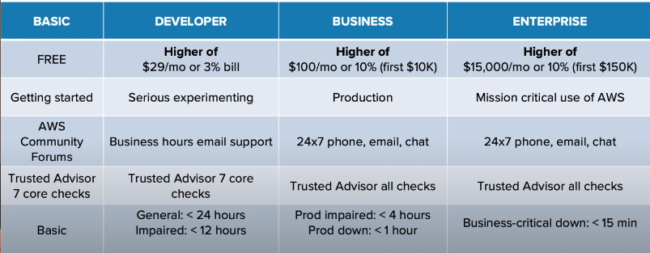

# AWS Services Fundamentals 

> Arav Budhiraja | 20th August 2021

Course Link: https://my.ine.com/Cloud/courses/7160c9f4/aws-services-fundamentals

## Topics

1. Setup an AWS account 
2. Infrastructure 
3. Networking 
4. Compute
5. Storage 
6. Additional Services

## Learning Objectives 

1. Create a secure AWS account with billing alarms 
2. Define the fundamental resources of AWS 
3. Confident having general conversations about AWS infrastructure and services 
	- Virtual Private Clouds(VPC)
	- Networking in AWS
	- Compute
	- Storage

## Creating an AWS Account 

* Create an AWS Account 
	-	Support options 
* Understand the root account 
	* Best practice: Limit use of root
* Create a user account 
* Enable Multi Factor Authentication(MFA)
* Create a billing alarm 
	* Best practice: Multiple billing alarms
* Homework

### Create an AWS Account 

#### What you need to get started

* Valid Email Address. If the AWS account will be a business one, use a restricted organization email. Make sure more than 1 person has access to the business email. For experimenting with AWS we will use a personal email
* Valid Credit Card 

#### Support Options 



#### Understanding the root account 

If we are logging in with an email, we are logging into the root user

NOT an everyday login. We should not always be logging into the root. Root account has unlimited capabilities 

Setup MFA for root account 

We should not setup programmatic access keys for the root user 
Programmatic access keys are pieces of security credentials which can be used to run scripts in our AWS Console. Scripts should not be run as root as we can break our environment 

In most cases, only root has access to billing and cost 

GovCloud is needed when our organization wishes to work with the Government of USA

We need to use root when changing account settings, restoring IAM user permissions, activate IAM access to billing and cost, signing up for GovCloud and closing our account

In this case, we have to create an IAM User. IAM users will be the users which we will login into everyday. These users can be used by the operations team, security team, database team and developer team. We have to setup MFA for the IAM users

To setup MFA, we can use Google Authenticator(software), RSA Tokens(hardware) or Gemalto(hardware)

#### Creating an IAM User

1. Search for 'IAM' and click on 'IAM'
2. On the left hand side, click on 'Users' below 'Access Management'
3. Click on the blue button which says 'Add user'
4. Provide a username and give it 'AWS Management Console access'. 'Programmatic Access' can be enabled if we wish to run scripts in the console and use the CLI
5. Now select custom password and enter a strong password. Deselect 'Require password reset'. Click on next
6. Give the required permissions. Here, we can give this user the 'AdministrativeAccess' permission. This will give us access to all services and resources. We can also create a group such as 'adminGroup' and add the user to that group
7. Specify a tag and click on next 
8. Click on 'Create User' at the bottom left 
9. Now, a custom URL will be displayed. 
10. Go to the custom URL and provide the username and password 
11. Now we can access the management console for the new IAM user

#### Enabling MFA

1. Search for 'IAM' and click on 'IAM'
2. On the left hand side, click on 'Users' below 'Access Management'
3. Click on the user 
4. Click on the 'Security credentials' tab 
5. There, the assigned MFA device will be not assigned 
6. Click on 'Manage'
7. We will be using Google Authenticator. So click on 'Virtual MFA device' and click on continue 
8. Download Google Authenticator from the Google Play Store/App Store
9. Open the app and click on + in the bottom right corner 
10. Select 'Scan QR Code'
11. In AWS, click on show QR code 
12. Scan the QR Code using Google Authenticator 
13. Now we have to fill out 2 MFA codes. These codes will be the numbers which will be shown in the app. New codes are generated every 30 seconds
14. Click on assign MFA and now we have setup MFA 

#### Billing alarms 

IMPORTANT THING WE CAN ADD TO OUR ACCOUNT 

We should not start a service and leave it running. This will cause the bill to keep on increasing 

Billing alarms watch our account and if we reach a certain spending limit, it will alert us 

An alarm can be created using CloudWatch. The alarm which we will create is a part of the Simple Notification System(SNS). 

Billing alarms are basically sending a value on which we can keep an eye on to CloudWatch to monitor the value

SNS will take the email we supply and immediately send an email to us. The email will ask if we wish to use CloudWatch to send us alerts. If we click on confirm, then we will start receiving email for alarms. If we do not click on confirm, then CloudWatch will not send emails. Check the Spam folder for the confirmation email

Billing alarms are rule based alerts which are based on the AWS bill

CREATE MORE THAN ONE ALARM 

If our max allowable bill is $10, we should send alarms at $5, $7 and $9

If our bill reaches that limit, CloudWatch will alert us via an email

##### Creating billing alarms 

1. Search for CloudWatch in the services 
2. In the left bar, click on 'Billing' which is below 'Alarms'
3. Here, we can create an alarm by clicking on the orange button 
4. By default, it gives us exactly what we want 
5. At the bottom we can select if the estimated charge should be Greater/Greater or Equal/Lower or Equal/Lower and then specify the amount. If we select Greater and specify the amount as $10, then CloudWatch would alert us when our bill exceeds $10. Once we have specified the amount, click next
6. Now we can select the alarm trigger. Select 'In alarm' and 'Create a new topic'. Give a name for the topic and type in the email to which the alert will be sent
7. Go to the bottom and click on next 
8. Now we have to specify an alarm name and alarm description and click on next
9. And finally click on 'Create alarm'

#### Homework 

* Create another IAM user 
	* Give the user admin permission 
	* Setup MFA
* Create another billing alarm with CloudWatch
	* Set the alarm to trigger at 90% of the budget 

### Quiz

1. When setting the billing alarm why is it a best practice to set more than one alarm?

```txt
If the initial message is missed or no action is taken subsequent alarms at higher limits will fire. This helps ensure that action will be taken when spending limits are being approached.
```

2. What is one step you should take to protect your AWS root account?

```txt
Enable MFA for the root account
```

## AWS Infrastructure 

Elementary pieces of AWS

* AWS Data Centers 
* AWS Availability Zones(AZs)
* AWS Regions
	* Basic principles for selecting an AWS Region
* Amazon Virtual Private Cloud(VPC)
	* Amazon VPCs and Fault Tolerance 
* Amazon CloudFront

### AWS Data Centers

There is no magic involved

AWS uses traditional servers, storage and networking equipment 

They bring all of the above together and put it in a building. These buildings are known as data centers

In AWS, the data layer is the place in which users put our information into AWS

#### Features of AWS Data Centers

- Multiple layers of PHYSICAL SECURITY
- Making sure there is great backup power, HVAC and fire suppression
- Making sure the data layer is restricted and includes threat detection devices
- Location of the data center so that environmental issues can be avoided 

Even if we are going to build a simple web app, we automatically inherit all of the above features, even though we may not need them 

### AWS Availability Zones(AZs)

DATA CENTERS GO INTO AVAILABILITY ZONES

One or more data centers collected together which maybe close to each other 

Lets us build a fault tolerant and highly available service 

Best practice would be to use more than one AZ

We can put our app into many AZs giving us high bandwidth and low latency such that it feels they are all in 1 data center. If 1 AZ is down, our app will be still be running as the other AZ is up

#### Features of AZs

* Interconnected by high bandwidth, low latency and redundant networks
* All network traffic between AZs are encrypted 
* AZs are physically separated from one another, but are within 60 miles of each other 

As of 2021, there are 80 Availability Zones in the entire world, not in each region(approx)

### AWS Regions 

AVAILABILITY ZONES GO INTO REGIONS 

 Made up of multiple, isolated and physically separated availability zones 

SELECT THE REGION WHICH IS CLOSEST TO OUR END USERS 

Allows developers to use the infrastructure that complies with data regulations from a certain part of the word and/or is closest to end user

As of 2021, there are 25 regions(approx)

Our region is displayed in the top right corner, next to your username 

Upon clicking on it, we can see the other regions and their short forms 

If we see that something such as EC2 instance is missing, we should check if we are in the correct region 

Some services can only be found in specific regions. There are some services such as IAM and S3 whose region is set to 'Global' which means that it can be accessed from all regions, be it Mumbai/Virginia/South Africa

S3 as a service is global but the buckets can be setup in different regions 

#### Selecting an AWS Region

1. Data Regulations: Are there regulatory considerations for the data which will be processed? 
2. AWS Services: Are the required AWS services available in that region? AWS DOES NOT PUSH OUT NEW SERVICES TO REGIONS SIMULTANEOUSLY. It tends to roll out services from 1 region to the next and normally starts from Virginia 
3. Geographic Location: Is the region geographically near your intended end users. We should not select the region as Australia if we want our end users to be people from USA/South America/Europe
4. Fault Tolerance: Do we need the highest levels of fault tolerance from the infrastructure? We may have to setup our app in more than 1 region, if 1 region does not support a requirement

### Amazon Virtual Private Cloud(VPC)

A private cloud for our organization within AWS

A VPC consists of an Availability Zone which is running many services

We should setup more than 1 AZ, so that if 1 goes down, the other one is still up and running 

For high levels of fault tolerance, we can setup our VPC in another region and setup the exact same infrastructure 

### Amazon CloudFront 

Helps in getting closer to the end user

To get low latency to the end users, we will use a content distribution network(CDN) known as Amazon CloudFront 

* 255+ sites in the world
* Speeds up delivery of websites and speeds up live and on-demand video streaming
* Automatically routes traffic to the most performant AWS edge locations 

We have an app in Ohio but our user is in Rio. The first time the user access the website, a request is sent to the CloudFront site in Rio. The request is then sent from the site at Rio to the site in Ohio. The site in Ohio then sends the contents of the website to the site in Rio. The site in Rio stores the website contents in it's cache and then forwards the contents to the user in Rio. At the same time, if another user also accesses the website, then a request is sent to the site in Rio which instantly forwards the website contents to the user. It does not request the site in Ohio for the website since it has stored contents in it's cache. This will offer much lower latency and quicker response time.

### Quiz

1. What is the correct order of infrastructure at AWS as it relates to data centers, availability zones, and regions?

```txt
Data centers go into availability zones, availability zones go into regions
```

2. What are some considerations when choosing an AWS Region?

```txt
Regulatory restrictions concerning data processing
```
